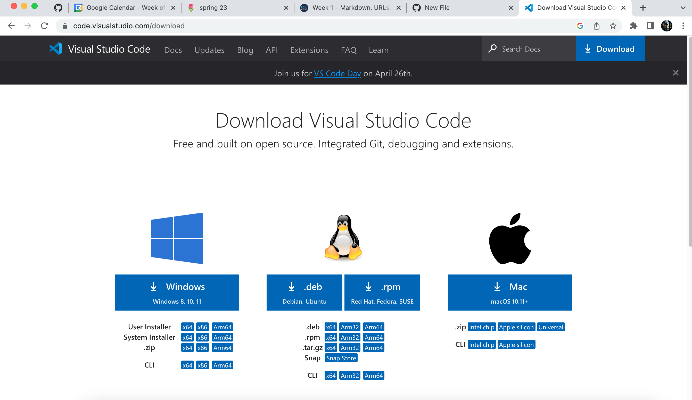
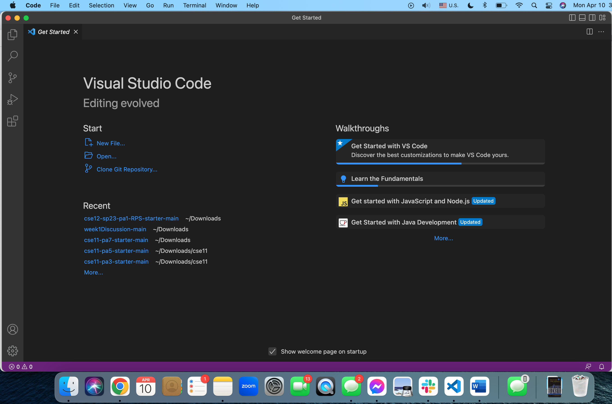
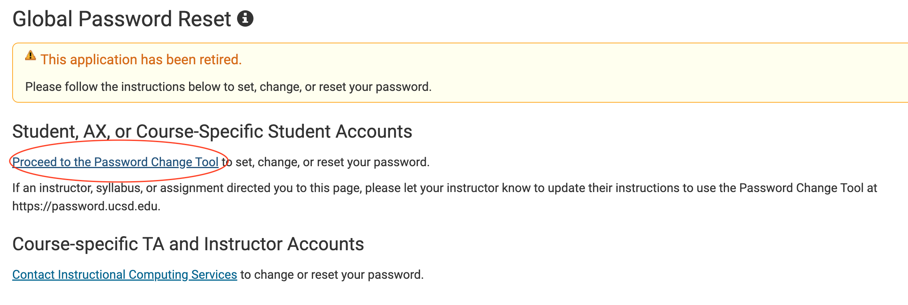
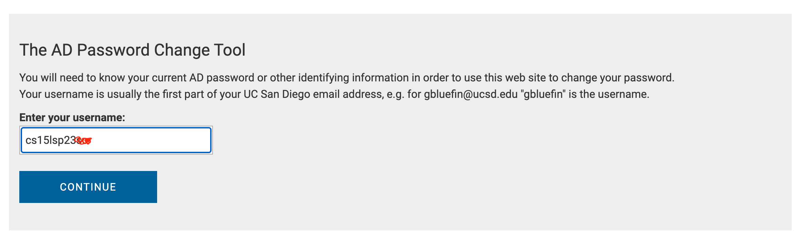
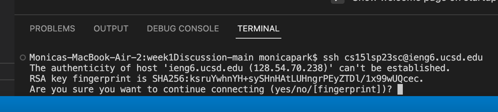
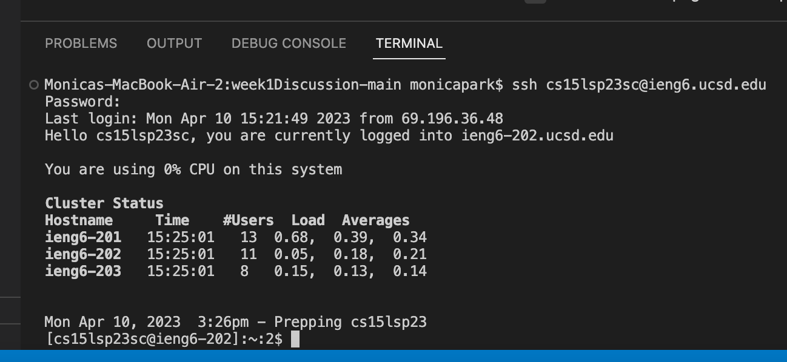
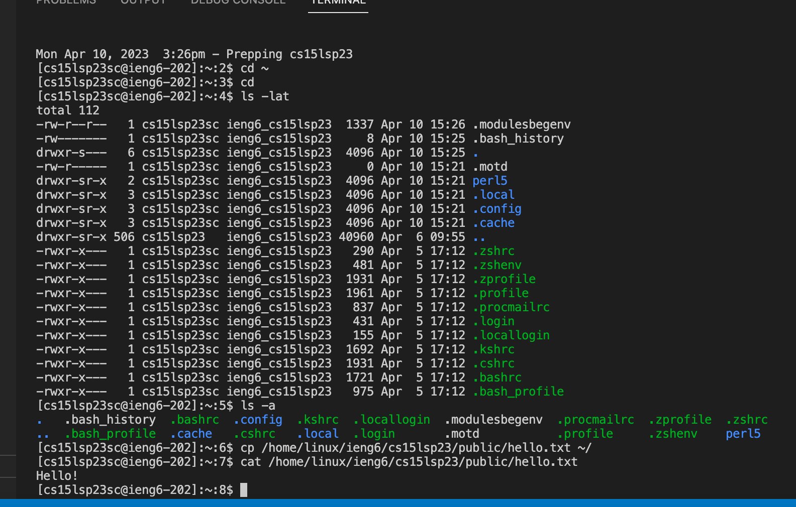
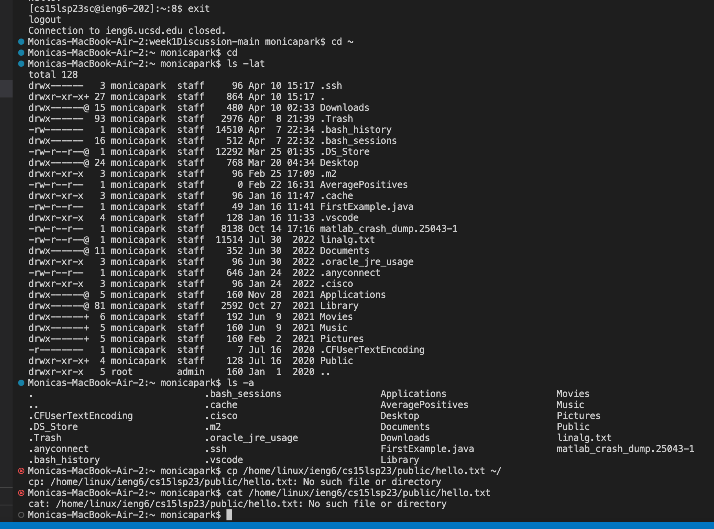

# Tutorial: How to log into a course-specific account on ieng6
a quick introduction to Remote Access and FileSystem

In this week's lab report, I will be walking through how to install VScode, remotely connect to the CSE server, then run commands on both the remote computer and your personal laptop.

## Part 1: Installing VScode
To start, install VS code by visiting [Link](https://code.visualstudio.com/download). Download the appropriate package depending on your computer.



When you download and finish installing the package, the app should open likeso:



## Part 2: Remotely Connecting

Next, you will need to locate your ieng6 username by entering your student id and PID at [Link](https://sdacs.ucsd.edu/~icc/index.php).
Once you enter these details, scroll down to "Additional Accounts" and make note of the student id (starting with "cs15lsp23") and click on the button, which allows you to reset the password with the global password change tool.






Proceed to the password change tool and reset the code with your email. After this, open VS code and create a new terminal, which should start with a bash $ code. After the $ sign, type in the command `ssh cs15lsp23zz@ieng6.ucsd.edu` replacing zz with your unique student code.



After running those code, authenticate the fingerprint by typing `yes` which will log you onto the remote server. The output should look something like this:



## Part 3: Trying Some Commands

Now you are on the remote server! Try running the following commands in the command line:

```
cd ~
cd
ls -lat
ls -a
cp /home/linux/ieng6/cs15lsp23/public/hello.txt ~/
cat /home/linux/ieng6/cs15lsp23/public/hello.txt
```

Here's what I got!

You can also run these commands on your personal laptop! Exit the remote server by typing in `exit` then rerun all the commands in the command line. I got:



Notice how the change directory commands (cd) had no ouput, but running the list (ls) commands have different outputs for the remote and personal servers since each computer has different files in their directory! Furthermore, the copy files command (cp) and concatenate files command (cat) that contained paths that only refer to the remote computer with the ieng6 accounts, and only had meaningful outputs for the remote server; such paths could not be found on the personal computer.

Thank you for reading :)
