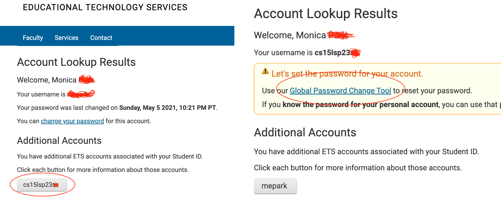

# Tutorial: How to work in servers and troubleshoot bugs
a quick introduction to how to set up a server and deal with failure-inducing inputs

In this week's lab report, we'll be creating a server called `StringServer`! We will then analyze how this server handles user input, possible bugs, and how to fix these buggy inputs.

## Part 1: let's get started with StringServer!
blah blahahahahah
stuff writing blah

## Part 2: how do I deal with bugs?

TEXT TEXT blah blah [Link](https://sdacs.ucsd.edu/~icc/index.php).
more text blah blah

## Part 3: some things I learned in this lab

text

Thank you for reading :)
