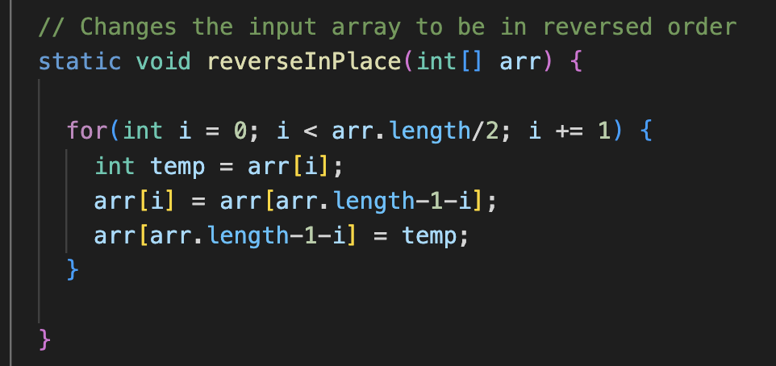
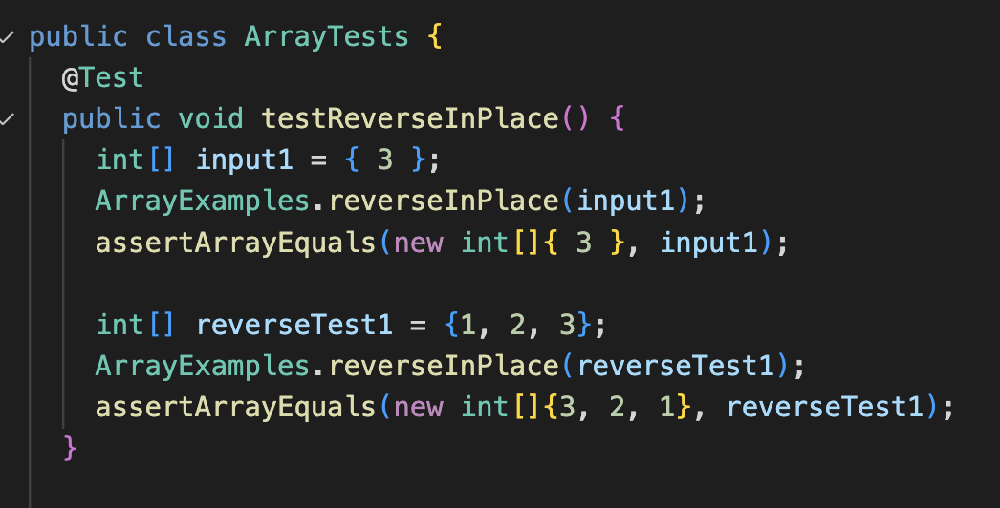

# Tutorial: How to create servers and troubleshoot bugs
a quick introduction to how to set up a server, as well as deal with failure-inducing inputs through jUnit testing

in this week's lab report, we'll be creating a server called `StringServer` to learn about URLhandlers and servers. After that, we will explore how to find and fix bugs in code by analyzing different inputs, symoptoms, and fixes to our code.

## Part 1: let's get started with StringServer!
The first half comes from the week 2 lab. To begin, every student created a fork of the provided repository ([click here](https://github.com/ucsd-cse15l-f22/wavelet)), which contains an implementation of the URL handler interface that we needed to create the server. From here, we forked the repository, created a clone in github desktop, then opened the folder in VS Code. From here, I used the provided NumberServer template to craft my StringServer.


Here, the handleRequest method uses getPath and getQuery method calls to decipher what the input url is saying, breaking down the user's url address into a path (`add-message`) as well as the query (`?s=<string>`) which is the string that the user writes in the url to be printed on the server! Each input gets added to a running string, and each added string is printed on a new line using the line break escape key, `\n`. Here are some examples of queries added to the url, which then print out to the server!


One interesting thing to note is that spaces typed in the omnibar are converted into `%20` which prints out as a space in the server below. Even if you directly type in %20, this will not print out but is interpretted as a space symbol in the server.


## Part 2: bugs, symptoms, and debugging
The second half comes from the week 3 lab. This lab also began with forking a repository (which you can find [here](https://github.com/ucsd-cse15l-w23/lab3)!). One bug in this code was in the reverseInPlace method that aims to flip an array, so the first becomes last, the last becomes first, second becomes second to last etc. There is an error with the code, which is implemented like so:

```
static void reverseInPlace(int[] arr) {
    for(int i = 0; i < arr.length; i += 1) {
      arr[i] = arr[arr.length - i - 1];
    }
  }
```

One failure inducing input for the method was the array {1, 2, 3}. When testing for the array 123 to become 321, the array actually became 323, which revealed a problem with the implementation of this method. An example of a failed jUnit test, in markdown and as a screenshot, are included below:

```
public void testReverseInPlace() {
    int[] reverseTest1 = {1, 2, 3};
    ArrayExamples.reverseInPlace(reverseTest1);
    assertArrayEquals(new int[]{3, 2, 1}, reverseTest1);
}
```


One input that did not throw an error is the array {3}. When testing if the array "reverses" to stay as an array of one element, {3}, the program threw no errors. Notice in the image above, no errors were thrown in the test for {3}. The jUnit test code can also be seen in the markdown here:

```
public void testReverseInPlace() {
    int[] input1 = { 3 };
    ArrayExamples.reverseInPlace(input1);
    assertArrayEquals(new int[]{ 3 }, input1);
}
```

These two tests show a symptom of the buggy code, which is that an array of 3 or more elements fails to "reverse" the elements in place, past the halfway mark of the array. This makes sense when looking at the code, since the code loops through the elements one by one and changes the items, and so the elements that were changed in the first half of the loop are then reflected in the second half, so that the later elements do not get replaced by elements of the original array, but elements after the array is already flipped. In effect, the second half of the array stays the same. As a fix, I created a temp variable to store the original element in the array and updated the second half item with this temporary element, rather than the new, flipped array. Here's the buggy code from before:
```
static void reverseInPlace(int[] arr) {
    for(int i = 0; i < arr.length; i += 1) {
      arr[i] = arr[arr.length - i - 1];
    }
  }
```

And here's fixed code that implements the temporary variable, `temp`:
```
static void reverseInPlace(int[] arr) {
    
    for(int i = 0; i < arr.length/2; i += 1) {
      int temp = arr[i];
      arr[i] = arr[arr.length-1-i];
      arr[arr.length-1-i] = temp;
    }
}
```

You can also see the fixed code and test in the images below :) This fix addresses the issue, because it stores the initial value of a first-half element in the array and uses it to update a second-half element in the array, rather than letting the loop alter all the elements in the first half first, letting these updated elements (rather than the original elements) be used to erroneously update elements in the second half of the array.




## Part 3: some things I learned in our week 2-3 labs

The last two labs were really interesting to me as I got to learn a lot about building servers, and also working with jUnit tests. I got to learn about ports, and how each server has a unique number that allows us to access a part of the web through a local host number, and I also got to learn how to write my own jUnit tests to test my code. I especially enjoyed writing the jUnit tests, because it allowed me to actually find bugs in the code, go back to attempt to change the implementation, then verify if this correction fixes the real issue in my code!

Thank you for reading :)
