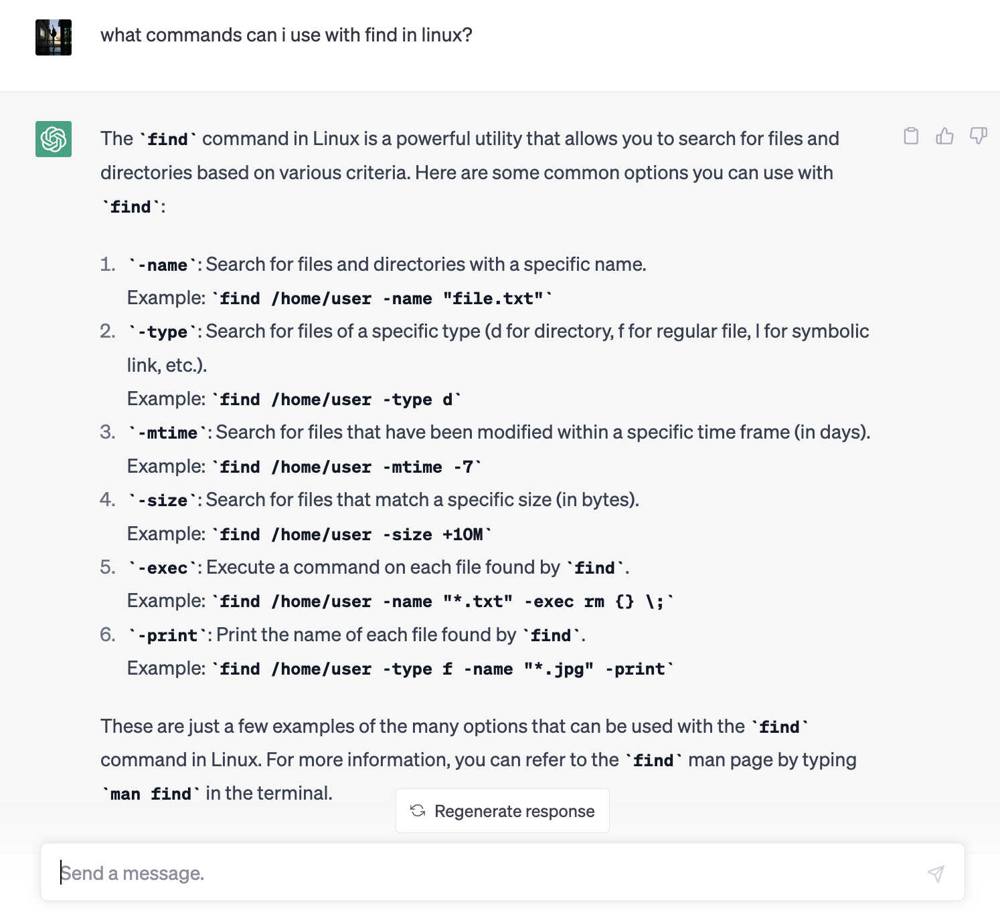

# walkthrough: researching and running commands in linux
in this week's lab report, we'll be researching about different commands in linux and running them in a directory called "technical" from a class repository called "docsearch."

## part 1: researching commands
This week, we were given 3 commands we could explore further: `less`, `find` or `grep`. I wanted to know a little more about the differences between find and grep, and decided to do a quick google search. I landed at [this](https://stackoverflow.com/questions/43165447/what-is-the-difference-between-find-with-grep) stack overflow page, where I found this helpful response by TheSprinter:


Based on this response, I learned that find is used to filter through a directory to locate specific files or folders, while grep (short for globally search a regular expression 
and print) searches through a specific file to find a specific pattern. This makes sense, since find takes the input of the command `find` followed by a directory, while `grep` 
also requires a regular expression that the program tries to match against the files in the specified directory. Since `find` seems a bit broader, I decided to search the manual for 
how to use find, by running `man find`. The result I got was:


By scrolling down, I found a list of different  options we can use under the `find` command! Two options that stood out to me were `-depth` and `-maxdepth` since we just started looking to graph traversals in our CSE12 class. The commands were described likeso:

```
-depth n
             True if the depth of the file relative to the starting point of the traversal is n.
-maxdepth n
             Always true; descend at most n directory levels below the command line arguments.
             If any -maxdepth primary is specified, it applies to the entire expression even if
             it would not normally be evaluated.  “-maxdepth 0” limits the whole search to the
             command line arguments.
```
To find two more options, I decided to try chat gpt. I searched for "what commands can i use with find in linux?" and found:



I will be exploring `-type` and `-print`. Print seems to be used in conjunction with a lot of the other commands, since the `find` command does not print the output to the terminal by default. Chat gpt describes these commands likeso:

```
-type: Search for files of a specific type (d for directory, f for regular file, l for symbolic link, etc.).
Example: find /home/user -type d


-print: Print the name of each file found by find.
Example: find /home/user -type f -name "*.jpg" -print
```

## part 2: -depth
`-depth` takes input n, and returns all files with a traversal of n relative to the starting point. in this demo, we are in the directory `technical`, and running the command with a depth of 1 should return all files directory inside the folder technical. I think the depth command is particularly useful as depth 1, because it finds all the files and directories directly inside a desired folder. It's like opening up a folder on a desktop and seeing what is directly inside just that one folder, without going deeper into the directories withiin that directory. Here's the command and output:
```
monicapark@Monicas-MacBook-Air docsearch % find ./technical -depth 1
./technical/government
./technical/plos
./technical/biomed
./technical/911report
```
When I ran the command with a depth of 2, the list of directories and files overflowed the terminal, as there were too many items! The same goes for depth of 3. Finally, when I ran depth 4, there was no output, which means the maximum number of folders within folders is 3, and after that, there are no more nested folders. This command can be useful to do a quick search of how "deep" a directory is in terms of branched directories, to get a quick scan of how many things are inside the directory. Here's the command and (lack of) output:
```
monicapark@Monicas-MacBook-Air docsearch % find ./technical -depth 4
```

## part 3: -maxdepth
`-maxdepth` takes input n and traverses a directory only until n depth. This command can be very useful when you don't want to search deeper into nested directories. I ran the commands with 0 and 1, and found that max depth returns just the command line directory for a depth of 0, and just the items within one folder for depth of 1. As the numbers increased, there were too many outputs that flooded the terminal, and so I would only use `-maxdepth` with small n's like 0, 1 or maybe 2 in the future. Here are the commands and ouputs for 0 and 1 under the technical directory:
```
monicapark@Monicas-MacBook-Air docsearch % find ./technical -maxdepth 0
./technical
monicapark@Monicas-MacBook-Air docsearch % find ./technical -maxdepth 1
./technical
./technical/government
./technical/plos
./technical/biomed
./technical/911report
```
Note that the output for `-maxdepth 1` and `-depth 1` look nearly identical, but maxdepth also includes `./technical` since it is inclusive of all depths from 0 (./technical) to 1, while depth is exclusive to directories at a depth of 1 (excludes depth 0).

## part 4: -type
`-type` allows us to search for different types of files, but is a little trickier to use because the type of file is specified by specific letters that we should know beforehand. I searched for `man find` again to look for specific types, and found this explanation:
```
-type t
             True if the file is of the specified type.  Possible file types are as follows:

             b       block special
             c       character special
             d       directory
             f       regular file
             l       symbolic link
             p       FIFO
             s       socket
```
I then tested out the directory (d) and regular file (f) commands. First, I ran the command with directories to find just the directories within technical. There were surprisingly a few number of folders, and I think I would use this command in the future when trying to see a quick overview of what groups of files I have.
```
monicapark@Monicas-MacBook-Air docsearch % find ./technical -type d
./technical
./technical/government
./technical/government/About_LSC
./technical/government/Env_Prot_Agen
./technical/government/Alcohol_Problems
./technical/government/Gen_Account_Office
./technical/government/Post_Rate_Comm
./technical/government/Media
./technical/plos
./technical/biomed
./technical/911report
```
I then ran the command with f, and the names of files overflowed the terminal. I narrowed down my search by combining the -depth command from earlier, and found that technical stores ONLY directories, and no files:
```
monicapark@Monicas-MacBook-Air docsearch % find ./technical -depth 1  -type f
```
Based on this output, I think `-type f` is not as useful of a command in directories where the majority of items are files, and the files will crowd the terminal. This could be more useful though if trying to narrow down a search with many other filters.


## part 5: -print
Finally, I explored the command `-print`! I was a little confused at first, because all the results seemed to be printing out to the terminal just fine. For example, when I ran the `-type d` command from earlier on its own, and also with print, the outputs looked the same:
```
monicapark@Monicas-MacBook-Air docsearch % find ./technical -type d                 
./technical
./technical/government
./technical/government/About_LSC
./technical/government/Env_Prot_Agen
./technical/government/Alcohol_Problems
./technical/government/Gen_Account_Office
./technical/government/Post_Rate_Comm
./technical/government/Media
./technical/plos
./technical/biomed
./technical/911report
monicapark@Monicas-MacBook-Air docsearch % find ./technical -type d -print          
./technical
./technical/government
./technical/government/About_LSC
./technical/government/Env_Prot_Agen
./technical/government/Alcohol_Problems
./technical/government/Gen_Account_Office
./technical/government/Post_Rate_Comm
./technical/government/Media
./technical/plos
./technical/biomed
./technical/911report
```
I then did a google search and found another helpful stack overflow [thread](https://unix.stackexchange.com/questions/197824/what-is-the-difference-between-find-and-find-print) on the purpose of the -print action. I found this helpful response by Stéphane Chazelas:

This taught me that `-print` is actually an internal action! There are other versions of print I can type to override the default print, such as `-print0`, which I tried here:
```
monicapark@Monicas-MacBook-Air docsearch % find ./technical -type d -print0
./technical./technical/government./technical/government/About_LSC./technical/government/Env_Prot_Agen./technical/government/Alcohol_Problems./technical/government/Gen_Account_Office./technical/government/Post_Rate_Comm./technical/government/Media./technical/plos./technical/biomed./technical/911report% 
```
The output differs from the regular print in the sense that all the output is strung together into one line, rather than printing with line breaks between each output. Interestingly, when I redirected this output into a `files.txt` file and printed the outputs, I got the one string of all the directories running into each other, but when I ran a word count on this file, I got 0 lines, 1 word, and 312 characters. I'm not sure why this evaluates to 0 lines, but it makes sense that it is 1 word since everything is jammed into each other.
```
monicapark@Monicas-MacBook-Air docsearch % find ./technical -type d -print0 > files.txt
monicapark@Monicas-MacBook-Air docsearch % cat files.txt
./technical./technical/government./technical/government/About_LSC./technical/government/Env_Prot_Agen./technical/government/Alcohol_Problems./technical/government/Gen_Account_Office./technical/government/Post_Rate_Comm./technical/government/Media./technical/plos./technical/biomed./technical/911report%                   
monicapark@Monicas-MacBook-Air docsearch % wc files.txt
       0       1     312 files.txt
monicapark@Monicas-MacBook-Air docsearch % 
```

Overall, this week's lab report taught me how to research more about each command, through resources like the terminal manual, chat gpt, and stack overflow, and will be useful for further exploration of commands in linux.
