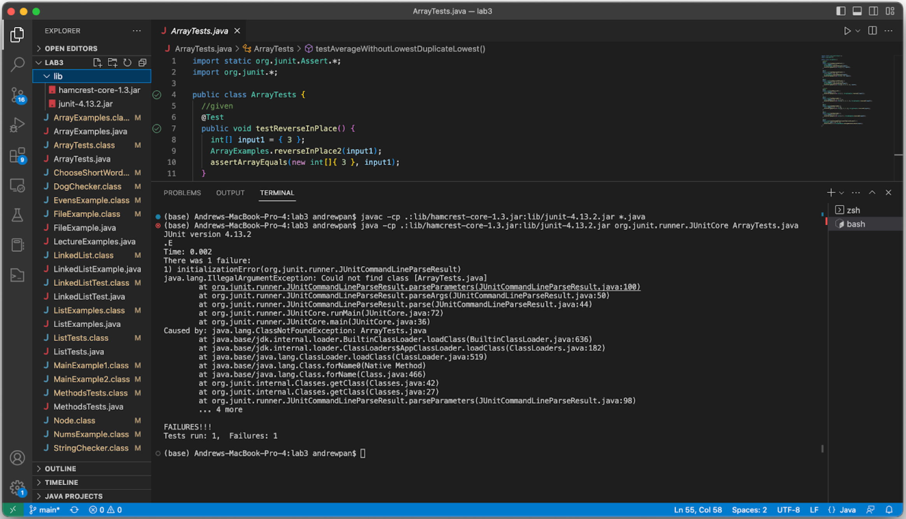

# final report: debugging and final reflections
in this week's lab report, i will be role playing as a TA responding to a student's debugging question on edstem! i will also reflect on my cse15L experience as a whole

## debugging
first, here is an example student post on edstem:
```
Hello! I am working on a mac OS in vscode, and am having trouble running the code. I've been working on the cse15L week 9 lab, 
and am having trouble compiling and running my testers. When I run javac, the code seems to compile, but when I try to run java 
on the specific file, nothing is running. I already tried to check what directory I am in by using ls to print out all my files 
in the current directory, so I can't figure out why my ArrayTests won't run. Thank you for all your help!
```


here's my example TA answer:
```
Hello, thank you for asking. Have you looked at other examples of compiling and running java on your files? Even though this is for 
a tester code, the syntax should be the same as all your other projects. Think about what the .java extension means, and any differences 
between ArrayTests and your ArrayTests.java. 
```

after this, the student realizes that the .java extension should only be included for the javac compile command, and not the java command. they respond:
```
Thank you so much for your help! I removed the .java in the java command, and was able to successfully run the code!
```

## final reflection
even though CSE15L isn't required for my major (bioinformatics), it was still a fun experience getting to learn how to use the command line to make my coding life much easier. 
i appreciated how transparent our professor was with AI learning and how we can effectively code in the 21st century, utilizing tools from the command line and also knowing how and to what extent we can utilize AI-aided code. 
i especially enjoyed all the in person labs where we could collaborate with our peers and TAs, as it helped me play around with the tools we learned and actually apply my learning. 
more specifically, i think i really enjoyed playing around on vim because it felt like something practical that i can use in my future cse courses. 
also! i really regret not learning how to use git clone earlier on to fork my repos, because for most of my cse coding life, i've always just downloaded zips and worked on my laptop, but in the future i could use git repos more effectively to save space on my computer, or to access my work from other computers too!
